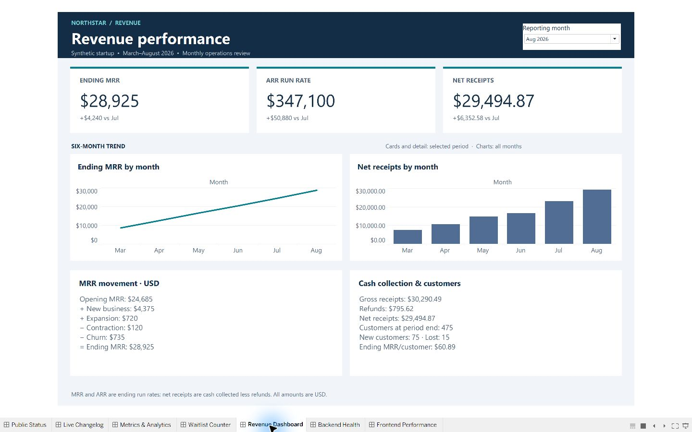

# Startup Operations Dashboards

Seven native Tableau dashboards for a monthly operating review of fictional Northstar startup data. This is an independent portfolio project, not client work.

[View the portfolio case study](https://david-edmonds.github.io/work/startup-operations/) · [Open Tableau Public](https://public.tableau.com/app/profile/david.edmonds5066/viz/Startup-Operations-Expanded/FrontendPerformance) · [Download the workbook](https://david-edmonds.github.io/startup-operations/Startup-Operations-Expanded.twbx)

## Business question

What changed this month, what explains it, and which operational signals deserve attention?

| Dashboard | Decision supported | Preview |
|---|---|---|
| Public Status | Review availability, downtime budget and incidents | [View](Expanded-Screenshots/01-Public-Status.jpg) |
| Live Changelog | Review release volume, rollback rate and lead time | [View](Expanded-Screenshots/02-Live-Changelog.jpg) |
| Metrics & Analytics | Understand acquisition and same-day activation | [View](Expanded-Screenshots/03-Metrics-Analytics.jpg) |
| Waitlist Counter | Reconcile additions, conversions and removals | [View](Expanded-Screenshots/04-Waitlist-Counter.jpg) |
| Revenue Dashboard | Explain MRR movement and cash collections | [View](Expanded-Screenshots/05-Revenue.jpg) |
| Backend Health Monitor | Investigate errors and response-time breaches | [View](Expanded-Screenshots/06-Backend-Health.jpg) |
| Frontend Performance | Review daily p75 observations and target attainment | [View](Expanded-Screenshots/07-Frontend-Performance.jpg) |

## Contents

- `Startup-Operations-Expanded.twbx`: editable Tableau workbook; seven dashboards, 70 worksheets and two embedded data extracts.
- `Expanded-Screenshots/`: seven actual Tableau presentation screenshots showing August 2026.
- `index.html`: portable screenshot gallery; open locally in a browser.
- [Usage and metric notes](START-HERE.md).
- [Design specifications](Expanded-Design-Guide.md).
- `validate.py`: dependency-free package integrity check.

## Use

Download the packaged workbook and open it in Tableau. Choose a dashboard and use **Reporting month** to update headline cards, comparisons and detail. Trend charts retain all six months. Presentation mode displays the full desktop layout.

The source is synthetic: 184 daily records for March–August 2026, 26 releases and eight resolved incidents. No accounts or paid data services are needed to view the public case study. Local editing requires a compatible Tableau installation.

## Analytical choices

21 headline metrics, 14 trend charts and 14 detail panels connect performance to context. Ratios divide aggregated numerators by aggregated denominators. Ending balances are not summed across days. MRR and waitlist opening-to-ending movements reconcile; monthly headline reconciliation checked 126 sample values.

MRR is a recurring run rate, while receipts represent cash collection. Waitlist throughput is not cohort conversion. Frontend figures are daily p75 observations, not monthly percentiles or a 28-day Core Web Vitals assessment.

## Validation and limits

All seven dashboards were inspected locally in Tableau. The published Tableau download was independently checked for all seven dashboards, 70 worksheets and two extracts. The live frontend reporting-month control was exercised. Portfolio screenshots and the exact download were verified after deployment.

Run `python projects/startup-operations/validate.py` from the repository root to check the bundled workbook hash, dashboard and worksheet counts, extracts, previews and portable gallery links. This verifies the published snapshot's structure; it does not rerun the metric calculations or replace Tableau rendering checks.

This is a demonstration, with no live feed, automatic refresh or alerts. Supporting details are precomputed and must be regenerated together with the daily extract when source data changes. This project package does not include the refresh toolkit; production-data replacement remains unvalidated. The public copy removes temporary local source paths while preserving both embedded data extracts.
